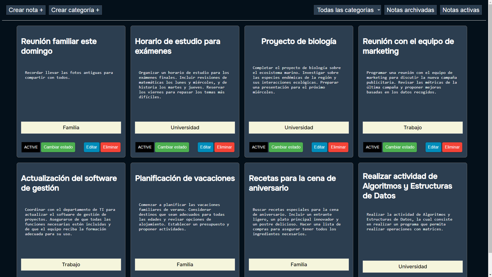

## NoteBoard Challenge

## User Stories

### Phase 01
* ✅ As a user, I want to be able to create, edit and delete notes. 
* ✅ As a user, I want to archive and unarchive notes.
* ✅ As a user, I want to list my active notes.
* ✅ As a user, I want to be able to list my archived notes.

### Phase 02
* ✅ As a user, I want to be able to add / remove categories to notes.
* ✅ As a user, I want to be able to filter notes by category.

## Project packages

* **com.noteboard.api.advice:** Contains the exception handler.
* **com.noteboard.api.dto.request:** Contains the DTOs of the requests.
* **com.noteboard.api.dto.response:** Contains the DTOs of the responses.
* **com.noteboard.api.exception:** Contains the custom exceptions.
* **com.noteboard.api.initialization:** Contains the class needed for database initialization (default database).
* **com.noteboard.api.persistence.entity:** Contains the database entities.
* **com.noteboard.api.persistence.repository:** Contains the database entity repositories.
* **com.noteboard.api.service:** Contains the application services.
* **com.noteboard.api.web.controller:** Contains the application controllers.
* **com.noteboard.api.web.security:** Contains the application's security configuration (CORS).

## Deployment 

* Google Cloud Platform (GCP) was used to deploy the backend of the application and Google SQL (MySQL) was used for the database.

* Vercel was used to deploy the frontend of the application.

[](https://noteboard-frontend.vercel.app/)
[Visit NoteBoard on Vercel](https://noteboard-frontend.vercel.app/)


> The first load is usually slow, since the GCP server and the Google SQL database are configured with the minimum resources, so that the GCP account credit is not consumed.


## Tools used 

# Backend
* [Spring Boot 3.2.1](https://spring.io/projects/spring-boot)
* [Spring Data JPA](https://spring.io/projects/spring-data-jpa)
* [Flyway](https://flywaydb.org/)
* [Lombok](https://projectlombok.org/)
* [MySQL 8.0.33](https://www.mysql.com/)
* [Java 17](https://www.oracle.com/java/technologies/downloads/#java17)

# Frontend
* [Vue.js 3](https://v3.vuejs.org/)
* [Vite](https://vitejs.dev/)
* [Node.js V20.10.0](https://nodejs.org/es/)


## Execution Script
```bash
DB_HOST="localhost"
DB_PORT=3306
DB_USER="your_username"
DB_PASS="your_password"
DB_NAME="noteboard"

check_db_connection() {
    echo "Checking database connection at $DB_HOST:$DB_PORT..."
    while ! mysql -h $DB_HOST -P $DB_PORT -u $DB_USER -p$DB_PASS -e "use $DB_NAME"; do
        echo "Waiting for the database to be available..."
        sleep 2
    done
    echo "Database connection established."
}

check_db_connection

cd path/to/frontend

echo "Starting Vue.js server..."
npm install
npm run serve &

cd path/to/backend
echo "Starting Spring Boot server..."
./mvnw spring-boot:run &

wait

```

Execution permissions need to be granted to the execution script

```bash
chmod +x start-app.sh
```

Run the execution script
```bash
./start-app.sh
```

**NOTE:** It is recommended to test the project after deploying it on GCP and Vercel

> All project requirements are met, for both phase 01 and phase 02.

